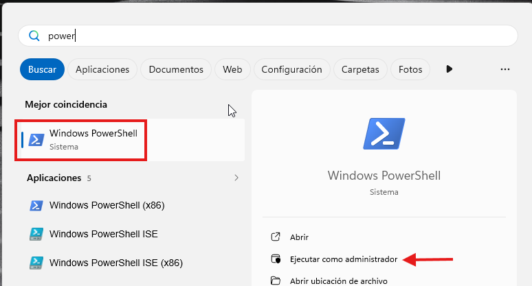
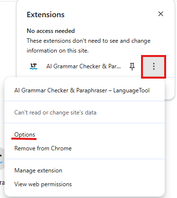
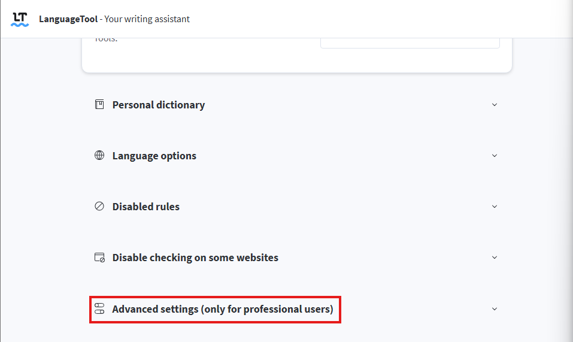
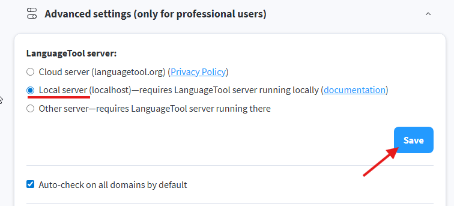

# Install LanguageTool on Windows (script)

This guide explains how to install LanguageTool locally on Windows using the
script `install.ps1`. It also covers how to install and configure the browser
extension to use your local server.

## Opening PowerShell as administrator

Click the **Start menu**, search for **PowerShell**, right-click on it and
select **Run as administrator**



## Install

Copy and run this command in the PowerShell window you just opened:

```powershell
Set-ExecutionPolicy Bypass -Scope Process -Force; iwr "https://raw.githubusercontent.com/toni-galan/language-tool-local-setup/windows-script/windows/install.ps1" | iex
```

The script will automatically:
- Install Java if not already installed
- Download and extract LanguageTool
- Configure LanguageTool to start automatically on every login
- Start the server immediately so no reboot is needed

## Extension

Once the script finishes, configure the LanguageTool browser extension to use
your local server instead of the cloud.

If you don't have the extension installed yet, get it from the
[Chrome Web Store](https://chromewebstore.google.com/detail/corrector-ortogr%C3%A1fico-y-g/oldceeleldhonbafppcapldpdifcinji?hl=es).

### Configuring the extension

Click on the extension icon → **three dots** → **Options**



Scroll to the bottom of the page and click **Advanced settings**



Change **Cloud server** to **Local server** and click **Save**



That's it. The extension will now use your local LanguageTool server.

> **Note:** LanguageTool will start automatically on every login. If it ever
> stops working, simply log out and back in, or run the script again.